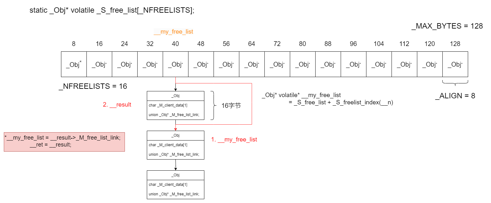
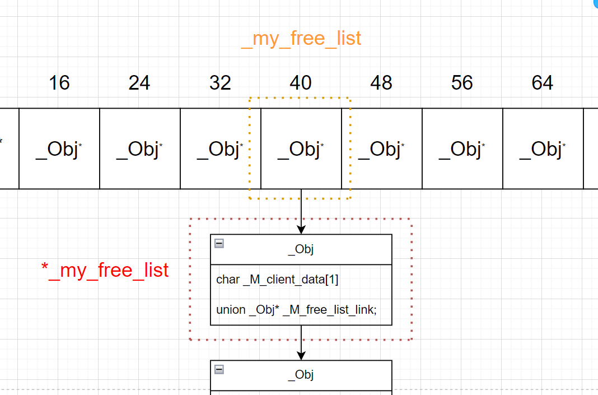

# SGI STL部分解读

## 1. SGI STL内存分配代码解读



### 注意事项
- (1) _S_free_list的元素是_Obj*类型的，因此，_my_free_list作为一个遍历_S_free_list上元素的指针，它应该是_Obj**类型的。
    ```cpp
    static _Obj* volatile _S_free_list[_NFREELISTS];

    _Obj* volatile* __my_free_list = _S_free_list + _S_freelist_index(__n); 
    ```
    第二行代码：从_S_free_list的起始位置找到指定位置，是发生在第一维上的。

- (2) 关于_S_chunk_alloc函数，虽然还不知内部实验，但从它的返回值来看：
    ```cpp
    char* __chunk = _S_chunk_alloc(__n, __nobjs);  // 负责内存开辟
    ```
    是一个一维指针，所以是发生在第二维上的，实际上它就是直接指向_Obj(chunk块)，因此：
    ```cpp
    *__my_free_list = __next_obj = (_Obj*)(__chunk + __n);
    ```
    