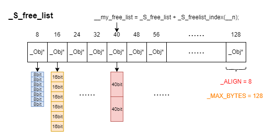
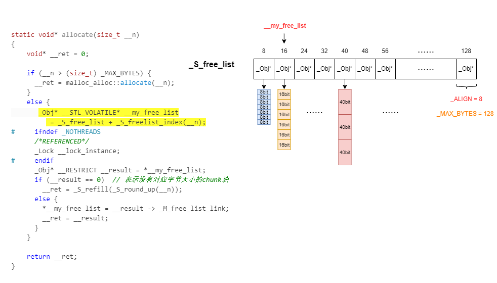
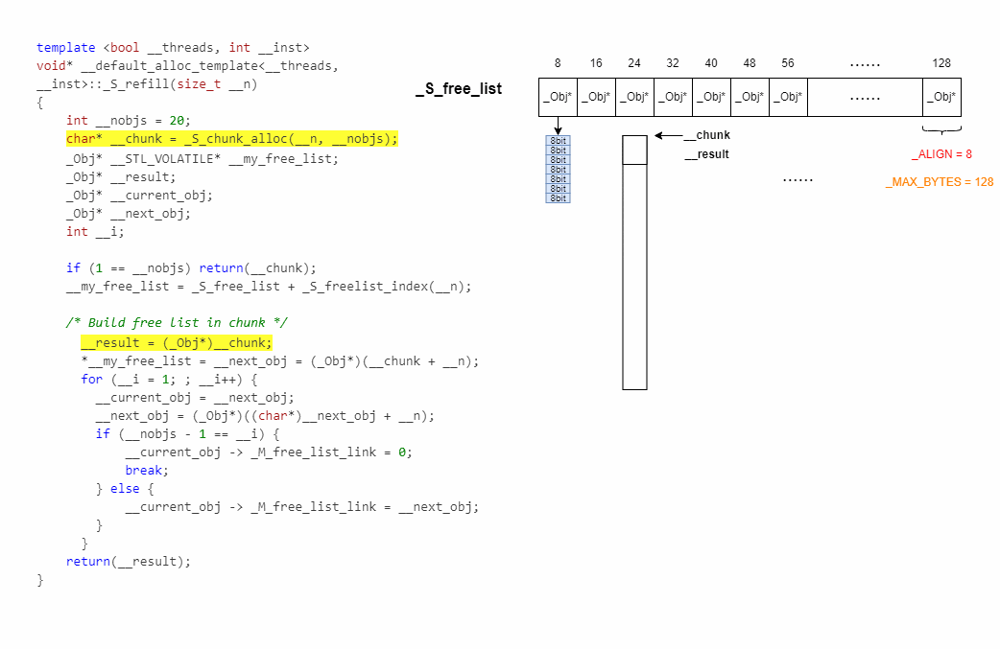
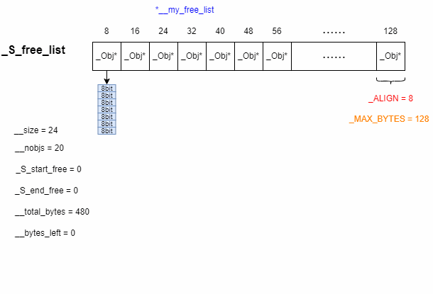
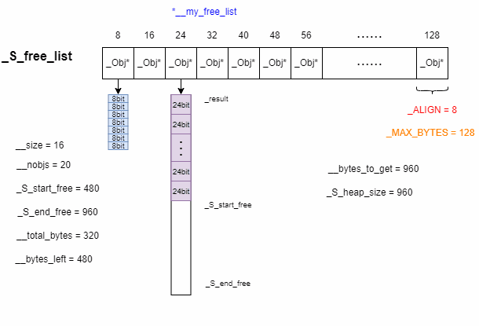
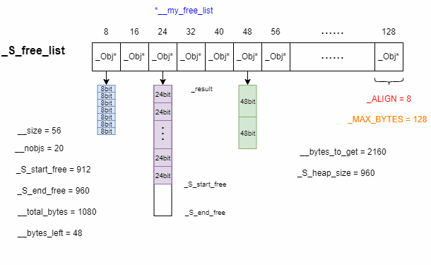
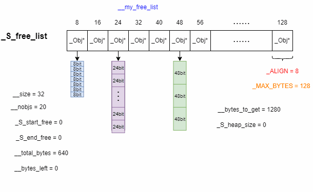
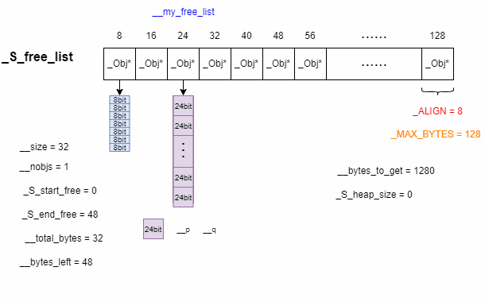

# SGI STL部分解读

## 0.内存池的意义：

防止小块内存频繁的开辟，释放，造成内存很多的碎片出来，内存没有更多连续的大内存块。所以引用对于小块内存的操作，一般会使用内存池来进行管理。

SGI STL二级空间配置器内存池的实现优点：
1. 对于每一个字节数的chunk块分配，都是给出一部分进行使用，另一部分作为备用，这个备用可以给当前字节数使用，也可以给其他字节数使用。
2. 对于备用内存池划分完chunk块以后，如果还有剩余的很小的内存块，再次分配的时候，会把这些小的内存块再次分配出去，备用内存池使用的干干净净。
3. 当指定字节数内存分配失败以后，有一个异常处理的过程，bytes-128字节的所有chunk块进行查看，如果哪个字节数有空闲的chunk块，直接借一个去。如果上面操作失败，还有调用一个oom_malloc这么一个预先设置好的malloc内存分配失败以后的回调函数。

## 1. SGI STL内存分配代码解读
### 一些重要的变量类型和方法：
```cpp
 union _Obj  // 类似链表节点
 {   
    union _Obj* _M_free_list_link;
    char _M_client_data[1];   
 }
```
```cpp
enum {_ALIGN = 8};  // chunk块大小按8字节增长，如8,16,24.....
enum {_MAX_BYTES = 128};  // 提供的最大的chunk块为128字节
enum {_NFREELISTS = 16};  // 自由链表的数量，每一个不同字节的chunk块都被开辟在一个自由链表中。
```
```cpp
// 组织所有自由链表的数组，数组的每一个元素的类型是_Obj*，全部初始化为0
static _Obj* volatile _S_free_list[_NFREELISTS];
```

```cpp
// __bytes 上调至最邻近的 8 的倍数
static size_t _S_round_up(size_t __bytes) 
{
    return (((__bytes) + (size_t) _ALIGN-1) & ~((size_t) _ALIGN - 1)); 
}

// 返回__bytes大小的chunk块位于 free-list 中的编号
static  size_t _S_freelist_index(size_t __bytes)
{
    return (((__bytes)+(size_t)_ALIGN - 1) / (size_t)_ALIGN - 1);
}
```
sqi stl内存管理的示意图大致如下，想要申请一个chunk供37字节的数据使用时，```_S_round_up(size_t __bytes)```得到的结果为40，通过```__my_free_list = _S_free_list + _S_freelist_index(__n);```定位到对应大小字节块所在的位置。



### (1) allocate()
```cpp
static void* allocate(size_t __n)
{
    void* __ret = 0;

    if (__n > (size_t) _MAX_BYTES) {
      __ret = malloc_alloc::allocate(__n);
    }
    else {
      _Obj* __STL_VOLATILE* __my_free_list
          = _S_free_list + _S_freelist_index(__n);
      // Acquire the lock here with a constructor call.
      // This ensures that it is released in exit or during stack
      // unwinding.
#     ifndef _NOTHREADS
      /*REFERENCED*/
      _Lock __lock_instance;
#     endif
      _Obj* __RESTRICT __result = *__my_free_list;
      if (__result == 0)  // 表示没有对应字节大小的chunk块
        __ret = _S_refill(_S_round_up(__n));
      else {
        *__my_free_list = __result -> _M_free_list_link;
        __ret = __result;
      }
    }

    return __ret;
}
```
如果想要申请的chunk块的大小超过了```_MAX_BYTES```即128，二级空间配置器最大只能分配128的大小，故直接使用一级的空间配置器。

有对应字节大小的chunk块的流程情况大致如下(取__n = 14)：


### (2) __S_refill()
正如上面代码所示，如果没有对应字节大小的chunk块了，那么就会调用```__S_refill()```函数进行创建。
```cpp
template <bool __threads, int __inst>
void* __default_alloc_template<__threads, __inst>::_S_refill(size_t __n)
{
    int __nobjs = 20;
    char* __chunk = _S_chunk_alloc(__n, __nobjs);  // 负责内存开辟
    _Obj* __STL_VOLATILE* __my_free_list;  // 遍历_S_free_list，因为是_Obj*类型元素，所以是二级指针
    _Obj* __result;
    _Obj* __current_obj;
    _Obj* __next_obj;
    int __i;

    if (1 == __nobjs) return(__chunk);
    __my_free_list = _S_free_list + _S_freelist_index(__n);

    /* Build free list in chunk */
      __result = (_Obj*)__chunk;  // char* -> _Obj*
      *__my_free_list = __next_obj = (_Obj*)(__chunk + __n);
      for (__i = 1; ; __i++) {
        __current_obj = __next_obj;
        __next_obj = (_Obj*)((char*)__next_obj + __n);
        if (__nobjs - 1 == __i) {
            __current_obj -> _M_free_list_link = 0;
            break;
        } else {
            __current_obj -> _M_free_list_link = __next_obj;
        }
      }
    return(__result);
}
```
先简单说明一下```_S_chunk_alloc(__n, __nobjs)```，这个函数会开辟一块指定大小的内存，然后返回这个内存的起始位置。
```__S_refill()```的大致流程如下：


### (3) _S_chunk_alloc()

```cpp
template <bool __threads, int __inst>
char*
__default_alloc_template<__threads, __inst>::_S_chunk_alloc(size_t __size, 
                                                            int& __nobjs)
{
    char* __result;
    size_t __total_bytes = __size * __nobjs;  // 内存池所要分配的字节数
    size_t __bytes_left = _S_end_free - _S_start_free;  // 剩余的字节数，初始_S_end_free和_S_start_free都是0

    if (__bytes_left >= __total_bytes) {
        __result = _S_start_free;
        _S_start_free += __total_bytes;
        return(__result);
    } else if (__bytes_left >= __size) {
        __nobjs = (int)(__bytes_left/__size);
        __total_bytes = __size * __nobjs;
        __result = _S_start_free;
        _S_start_free += __total_bytes;
        return(__result);
    } else {
        size_t __bytes_to_get = 
	  2 * __total_bytes + _S_round_up(_S_heap_size >> 4);
        // Try to make use of the left-over piece.
        if (__bytes_left > 0) {
            _Obj* __STL_VOLATILE* __my_free_list =
                        _S_free_list + _S_freelist_index(__bytes_left);

            ((_Obj*)_S_start_free) -> _M_free_list_link = *__my_free_list;
            *__my_free_list = (_Obj*)_S_start_free;
        }
        _S_start_free = (char*)malloc(__bytes_to_get);
        if (0 == _S_start_free) {
            size_t __i;
            _Obj* __STL_VOLATILE* __my_free_list;
	    _Obj* __p;
            // Try to make do with what we have.  That can't
            // hurt.  We do not try smaller requests, since that tends
            // to result in disaster on multi-process machines.
            for (__i = __size;
                 __i <= (size_t) _MAX_BYTES;
                 __i += (size_t) _ALIGN) {
                __my_free_list = _S_free_list + _S_freelist_index(__i);
                __p = *__my_free_list;
                if (0 != __p) {
                    *__my_free_list = __p -> _M_free_list_link;
                    _S_start_free = (char*)__p;
                    _S_end_free = _S_start_free + __i;
                    return(_S_chunk_alloc(__size, __nobjs));
                    // Any leftover piece will eventually make it to the
                    // right free list.
                }
            }
	    _S_end_free = 0;	// In case of exception.
            _S_start_free = (char*)malloc_alloc::allocate(__bytes_to_get);
            // This should either throw an
            // exception or remedy the situation.  Thus we assume it
            // succeeded.
        }
        _S_heap_size += __bytes_to_get;
        _S_end_free = _S_start_free + __bytes_to_get;
        return(_S_chunk_alloc(__size, __nobjs));
    }
}
```
-  一开始，内存池还没有分配该字节大小(假设为24字节)的chunk块，于是：
    

    第一次会开辟两倍大小的内存，另一半备用。

<br>

- 当前20个chunk块都被申请走之后，由于```__S_refill()```连接chunk块时把最后一个置为0，于是下次```allocate```时，result为0：
    ```cpp
    if (__result == 0)
        __ret = _S_refill(_S_round_up(__n));
    ```
    会继续调用```__S_refill()```，从而调用```_S_chunk_alloc()```, 此时：
    ```cpp
    __total_bytes = 480;
    __bytes_left = _S_end_free - _S_start_free = 480;
    ```
    依然满足```__bytes_left``` >= ```__total_bytes```，所以会把剩下的480字节也分配出去。
    ```cpp
    if (__bytes_left >= __total_bytes) {
        __result = _S_start_free;
        _S_start_free += __total_bytes;
        return(__result);
    } 
    ```
    第二次调用时，此时```_S_heap_size```是960而不是0
    ```cpp
    size_t __bytes_to_get = 
	  2 * __total_bytes + _S_round_up(_S_heap_size >> 4);
    ```
    于是```__bytes_to_get``` = 2 * 480 + ```_S_round_up(960 >> 4)``` = 960 + 64 = 1024字节，即48个chunk块，相比于上次的40个，这一次会开辟更多的chunk块.

<br>

- 当其他字节的chunk块有备用的开辟的空间，此时要开辟其他字节的chunk的内存空间时，会优先从其他字节chunk块的备用空间中分配。只要满足备用空间至少满足一个当前chunk块的大小：
    ```cpp
    else if (__bytes_left >= __size) {
        __nobjs = (int)(__bytes_left/__size);
        __total_bytes = __size * __nobjs;
        __result = _S_start_free;
        _S_start_free += __total_bytes;
        return(__result);
    }
    ```
    假设要开辟16字节的chunk块(此处```__total_bytes```为480而非图中的320)：
    

    如果只够开辟一个chunk块，即```__nobjs```为1，那么不需要在```_S_refill()```中各种连接，直接返回chunk块的地址即可。
    ```cpp
    if (1 == __nobjs) return(__chunk);
    ```

<br>

- 如果剩下的备用空间不够开辟一个当前字节数的chunk块
    
    例如，24字节对应的chunk块空间只剩下48字节，但是想要为56字节的chunk块开辟空间，则把剩下的48字节给到48字节chunk块的头部，然后再开辟新的空间。
    
    剩下的备用空间一定是8的倍数，且小于等128，故一定可以找到一个地方放置。之后会malloc开辟一个新的空间给到```_S_start_free```。

<br>

- 如果内存开辟失败了

    ```cpp
    if (0 == _S_start_free)
    ```
    则会在第一维度上往后(前面的字节块太小不够用，比如要申请32字节大小的肯定从32往后如40开始找)遍历，找到某一字节下面下挂有chunk块，用它的第一个chunk块为己所有。

    假设我要申请32字节大小的chunk块，但是申请失败了，于是：
    
    然后就是回到上面的情况，按上面的情况进行操作。

<br>

- 如果后续没有可以利用的chunk块，即```__my_free_list```遍历到最后也没找到，故：
    ```cpp
    _S_end_free = 0;	// In case of exception.
    _S_start_free = (char*)malloc_alloc::allocate(__bytes_to_get);
    ```
    通过一个回调函数```__my_malloc_handler```, 处理那些可以释放的内存将其释放。在一个死循环内，不断的调用，直到开辟成功。
    ```cpp
    for (;;) {
        __my_malloc_handler = __malloc_alloc_oom_handler;
        if (0 == __my_malloc_handler) { __THROW_BAD_ALLOC; }
        (*__my_malloc_handler)();
        __result = malloc(__n);
        if (__result) return(__result);
    }
    ```


### (4) deallocate()
```cpp
static void deallocate(void* __p, size_t __n)
  {
    if (__n > (size_t) _MAX_BYTES)
      malloc_alloc::deallocate(__p, __n);
    else {
      _Obj* __STL_VOLATILE*  __my_free_list
          = _S_free_list + _S_freelist_index(__n);
      _Obj* __q = (_Obj*)__p;

      // acquire lock
#       ifndef _NOTHREADS
      /*REFERENCED*/
      _Lock __lock_instance;
#       endif /* _NOTHREADS */
      __q -> _M_free_list_link = *__my_free_list;
      *__my_free_list = __q;
      // lock is released here
    }
  }
```




### (5) reallocate()
重新分配(扩容或缩容)，开辟一串新的chunk块，把原先数据拷贝过去。
```cpp
template <bool threads, int inst>
void*
__default_alloc_template<threads, inst>::reallocate(void* __p,
                                                    size_t __old_sz, // 原先内存块大小
                                                    size_t __new_sz)  // 新的内存块大小
{
    void* __result;
    size_t __copy_sz;

    // 说明开辟的内存不是从内存池取出来给外部提供的，是通过一级空间配置器开辟的内存
    if (__old_sz > (size_t) _MAX_BYTES && __new_sz > (size_t) _MAX_BYTES) {
        return(realloc(__p, __new_sz));  // 调用系统的库函数来管理
    }
    // 如果前后大小一样，那就不管，或者说6.7，round_up后都是8，不用管
    if (_S_round_up(__old_sz) == _S_round_up(__new_sz)) return(__p);
    // 分配__new_sz大小的chunk块
    __result = allocate(__new_sz);
    __copy_sz = __new_sz > __old_sz? __old_sz : __new_sz;
    // 拷贝
    memcpy(__result, __p, __copy_sz);
    // 释放chunk块
    deallocate(__p, __old_sz);
    return(__result);
}
```