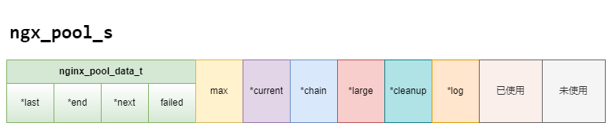
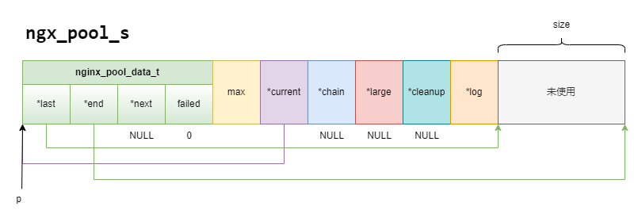
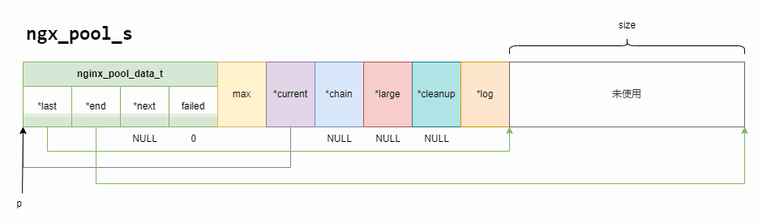
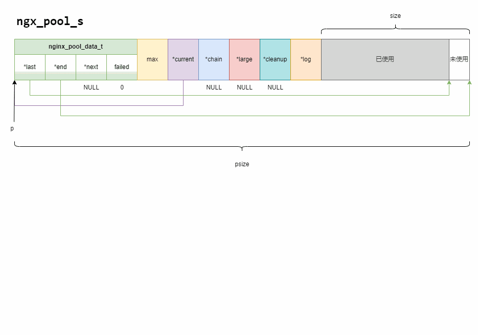
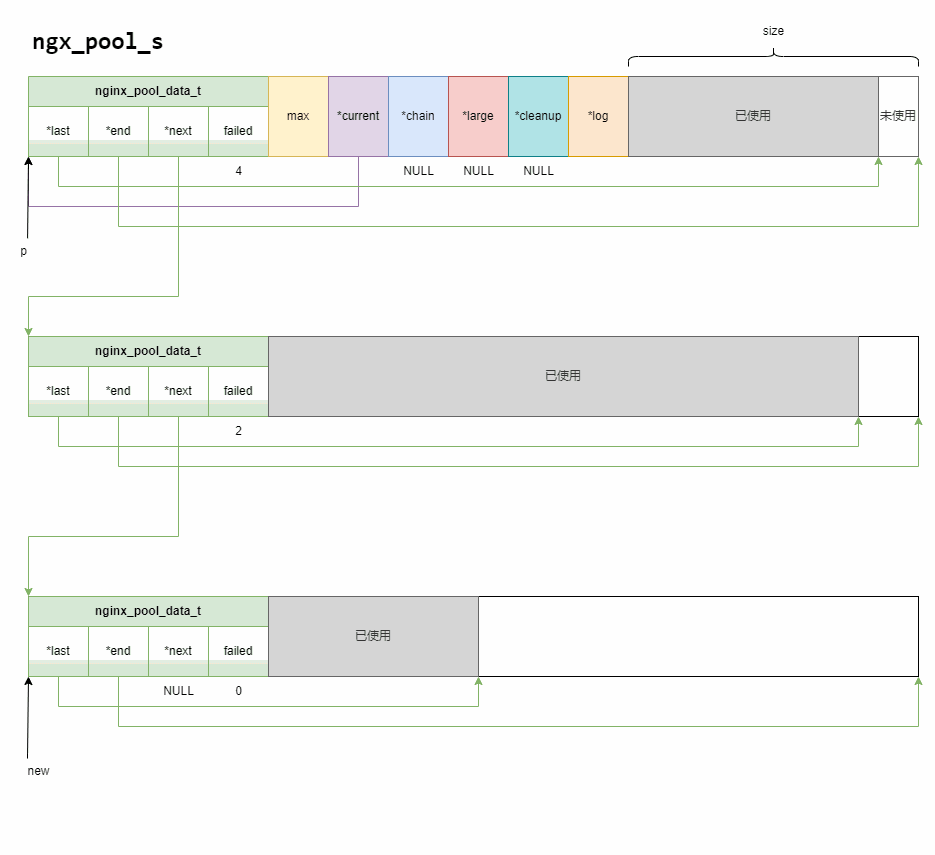
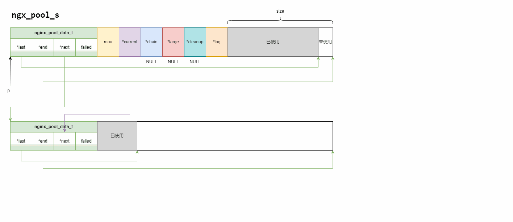
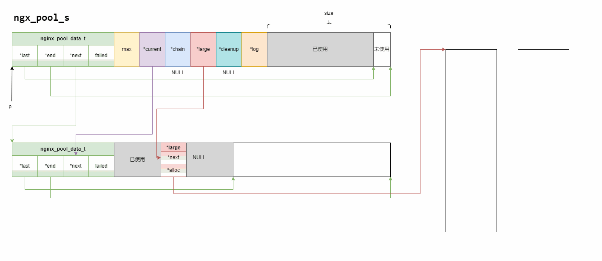
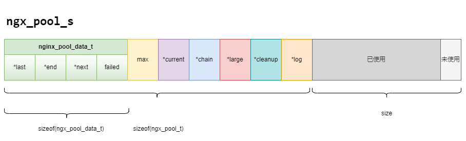
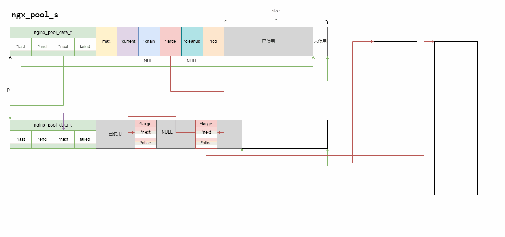

# nginx内存池解读

## 1. 一些重要的变量和方法

```cpp
struct ngx_pool_s {  // 内存池头信息
    ngx_pool_data_t       d;  // 数据信息
    size_t                max;  // 可以分配的最大内存，不会超过一个页面
    ngx_pool_t           *current;  // struct ngx_pool_s的typedef
    ngx_chain_t          *chain;  // 链接内存池
    ngx_pool_large_t     *large;  // 大块内存的入口指针
    ngx_pool_cleanup_t   *cleanup;  // 有关的清理行为
    ngx_log_t            *log;  // 日志
};
```
其中```ngx_pool_data_t```表示内存池头部信息：
```cpp
typedef struct {
    u_char               *last;
    u_char               *end;
    ngx_pool_t           *next;
    ngx_uint_t            failed;
} ngx_pool_data_t;
```


## 2. 创建nginx内存池
```cpp
ngx_pool_t * ngx_create_pool(size_t size, ngx_log_t *log)
{
    ngx_pool_t  *p;

    p = ngx_memalign(NGX_POOL_ALIGNMENT, size, log);
    if (p == NULL) {
        return NULL;
    }

    p->d.last = (u_char *) p + sizeof(ngx_pool_t);
    p->d.end = (u_char *) p + size;
    p->d.next = NULL;
    p->d.failed = 0;

    size = size - sizeof(ngx_pool_t);  // 实际上内存池可以使用的大小，去掉头信息占用
    p->max = // 可以分配的最大内存大小，取较小值
    (size < NGX_MAX_ALLOC_FROM_POOL) ? size : NGX_MAX_ALLOC_FROM_POOL;  

    p->current = p;
    p->chain = NULL;
    p->large = NULL;
    p->cleanup = NULL;
    p->log = log;

    return p;
}
```

注意这里未使用和已使用的空间远大于前面的区域。

<br>

- 函数```ngx_memalign```，在不同的宏定义情况下，函数的实现有所不同：
    ```cpp
    #if (NGX_HAVE_POSIX_MEMALIGN || NGX_HAVE_MEMALIGN)

    void *ngx_memalign(size_t alignment, size_t size, ngx_log_t *log);

    #else

    #define ngx_memalign(alignment, size, log)  ngx_alloc(size, log)

    #endif
    ```
    如两个宏: ```NGX_HAVE_POSIX_MEMALIGN``` 和 ```NGX_HAVE_MEMALIGN``` 都没有定义，则函数```ngx_memalign``` 直接使用 ```ngx_alloc```, ```ngx_alloc``` 实现的就是简单的malloc开辟内存，成功与否都会更新日志。
    ```cpp
    void * ngx_alloc(size_t size, ngx_log_t *log)
    {
        void  *p;

        p = malloc(size);
        if (p == NULL) {
            ngx_log_error(NGX_LOG_EMERG, log, ngx_errno,
                        "malloc(%uz) failed", size);
        }

        ngx_log_debug2(NGX_LOG_DEBUG_ALLOC, log, 0, "malloc: %p:%uz", p, size);

        return p;
    }
    ```
    由于定义是一样的，只有实现方面不同，故两种宏的情况在定义出合并为```(NGX_HAVE_POSIX_MEMALIGN || NGX_HAVE_MEMALIGN)```. 当宏定义 ```NGX_HAVE_POSIX_MEMALIGN``` 存在时，函数的实现为：
    ```cpp
    void * ngx_memalign(size_t alignment, size_t size, ngx_log_t *log)
    {
        void  *p;
        int    err;

        err = posix_memalign(&p, alignment, size);

        if (err) {  // 注意成功返回0，不成功非0
            ngx_log_error(NGX_LOG_EMERG, log, err,
                        "posix_memalign(%uz, %uz) failed", alignment, size);
            p = NULL;
        }

        ngx_log_debug3(NGX_LOG_DEBUG_ALLOC, log, 0,
                    "posix_memalign: %p:%uz @%uz", p, size, alignment);

        return p;
    }
    ```
    当宏定义 ```NGX_HAVE_MEMALIGN``` 存在时，函数的实现为：
    ```cpp
    void * ngx_memalign(size_t alignment, size_t size, ngx_log_t *log)
    {
        void  *p;

        p = memalign(alignment, size);
        if (p == NULL) {
            ngx_log_error(NGX_LOG_EMERG, log, ngx_errno,
                        "memalign(%uz, %uz) failed", alignment, size);
        }

        ngx_log_debug3(NGX_LOG_DEBUG_ALLOC, log, 0,
                    "memalign: %p:%uz @%uz", p, size, alignment);

        return p;
    }
    ```
    ```posix_memalign``` 和 ```memalign``` 都是系统的api，是标准C库中的内存分配函数，用于满足特定对齐要求的内存分配需求。前者会尝试分配一个大小为size字节，按照alignment字节对齐的内存块，并将其起始地址存储在p中。后者则返回已分配内存的地址。这两个函数在window都没有。

    后续的操作大致如下：
    

### 3. 从内存池中申请内存
主要有两种函数：```ngx_palloc```, ```ngx_pnalloc```, 区分点在于考不考虑对齐：

```cpp
void* ngx_palloc(ngx_pool_t *pool, size_t size)
{
#if !(NGX_DEBUG_PALLOC)
    if (size <= pool->max) {
        return ngx_palloc_small(pool, size, 1); // 考虑对齐
    }
#endif

    return ngx_palloc_large(pool, size);
}
```

```cpp
void* ngx_pnalloc(ngx_pool_t *pool, size_t size)
{
#if !(NGX_DEBUG_PALLOC)
    if (size <= pool->max) {
        return ngx_palloc_small(pool, size, 0);  // 不考虑对齐
    }
#endif

    return ngx_palloc_large(pool, size);
}
```
二者的逻辑非常清晰，如果要分配的内存大小小于等于```pool->max```, 那么就调用小块内存的分配函数```ngx_palloc_small```，如果大于```pool->max```, 那么就调用大块内存的分配函数```ngx_palloc_large```.

- 小块内存的分配函数```ngx_palloc_small```
    ```cpp
    static ngx_inline void* ngx_palloc_small(ngx_pool_t *pool, size_t size, ngx_uint_t align)
    {
        u_char      *m;
        ngx_pool_t  *p;

        p = pool->current;  // 先看current指向哪个内存块

        do {
            m = p->d.last;  // 找到可用空间的起始位置

            if (align) {
                m = ngx_align_ptr(m, NGX_ALIGNMENT);
            }

            if ((size_t) (p->d.end - m) >= size) {  // 判断空间够不够
                p->d.last = m + size;

                return m;
            }

            p = p->d.next;

        } while (p);

        return ngx_palloc_block(pool, size);
    }
    ```
    

    如果```(size_t) (p->d.end - m) < size``` ，即小块内存的分配过程，当前内存块没有足够的空间了，则不会走到有return的语句，并且初始化的时候```d.next```是NULL，于是就退出了循环，执行函数```ngx_palloc_block()```，开辟新的内存块等一系列操作。新开辟的内存块只需要```ngx_pool_data_t```，不需要额外的信息，见下图。
    
    简言之，如果当前内存块有足够空间，就在此分配，如果没有，就看下一个内存块。如果所有内存块都没有足够空间，就调用```ngx_palloc_block()```开辟。

    ```cpp
    static void* ngx_palloc_block(ngx_pool_t *pool, size_t size)
    {
        u_char      *m;
        size_t       psize;
        ngx_pool_t  *p, *new;

        psize = (size_t) (pool->d.end - (u_char *) pool);  // 原先池的大小

        m = ngx_memalign(NGX_POOL_ALIGNMENT, psize, pool->log);  // 开辟新的内存
        if (m == NULL) {  // 开辟失败的话....
            return NULL;
        }

        new = (ngx_pool_t *) m;  // 新池的起点

        new->d.end = m + psize;  // 新池的结尾
        new->d.next = NULL;
        new->d.failed = 0;  // 记录内存分配失败的次数

        m += sizeof(ngx_pool_data_t);  // 定位到max?
        m = ngx_align_ptr(m, NGX_ALIGNMENT);  // 
        new->d.last = m + size;

        for (p = pool->current; p->d.next; p = p->d.next) {
            if (p->d.failed++ > 4) {
                pool->current = p->d.next;
            }
        }

        p->d.next = new;

        return m;
    }
    ```
    

    注意```failed```, 它记录内存分配“失败”的次数。如果发现剩余空间不足以分配对应大小的内存，累计五次，这个内存块就会被认为剩余空间足够小，就不会再使用。当然前提是他的```next```不为NULL，为NULL的话应该先去创建新的空间。

    ```cpp
    for (p = pool->current; p->d.next; p = p->d.next) {
        if (p->d.failed++ > 4) {
            pool->current = p->d.next;
        }
    }
    ```
    这段代码是指当开辟完新的内存块，分配出去内存之后。结合```ngx_palloc_small```函数中的```do while```循环，可知：访问第一个内存块，发现空间不够了，就通过```p = p->d.next;```访问下一个内存块，重复如此，如果每一个都不够，那就开辟新的内存块。此时前面的内存块都需要把它们对应的```failed```加一，便是通过这个```for```循环实现的。如果累计五次，就执行```pool->current = p->d.next;```, 即不再使用这个内存块。因为正如```ngx_palloc_small```中所示，要先看```current```指向哪个内存块。
    

<br>

- 大块内存的分配函数```ngx_palloc_large```

    ```cpp
    static void* ngx_palloc_large(ngx_pool_t *pool, size_t size)
    {
        void              *p;
        ngx_uint_t         n;
        ngx_pool_large_t  *large;  

        p = ngx_alloc(size, pool->log);  
        if (p == NULL) {
            return NULL;
        }

        n = 0;

        // 遍历大块内存
        for (large = pool->large; large; large = large->next) {
            if (large->alloc == NULL) {
                large->alloc = p;
                return p;
            }

            if (n++ > 3) {  // 如果遍历了三次还没找到空的头，就直接创建新的大块内存头
                break;
            }
        }

        large = ngx_palloc_small(pool, sizeof(ngx_pool_large_t), 1);
        if (large == NULL) {   // 如果大块内存头信息开辟失败
            ngx_free(p);  // 就把刚开辟的大块内存释放掉
            return NULL;
        }
        // 头插法
        large->alloc = p;
        large->next = pool->large;
        pool->large = large;

        return p;
    }
    ```
    这里的 ```ngx_pool_large_t*``` 类似于链表节点，包括一个地址域和数据域，后者存放着开辟的大块内存的地址。可以认为是大块内存的头信息，它存放的位置与小块内存的位置一样，并且也是通过小块内存的分配方式分配。
    ```cpp
    typedef struct ngx_pool_large_s  ngx_pool_large_t;

    struct ngx_pool_large_s {
        ngx_pool_large_t     *next;
        void                 *alloc;
    };
    ```
    
    

    另外，并非每一个大块内存信息头下面都挂着一个大块内存，大块内存随时都会被释放掉，因此，可能存在没有挂着内存的信息头。因此在创建新的头之前：
    ```cpp
    large = ngx_palloc_small(pool, sizeof(ngx_pool_large_t), (ngx_pool_large_t), 1);
    ```
    会先用for循环进行遍历，查找有无没有下挂内存的信息头即```large->alloc == NULL```, 那么就把刚开辟的大块内存挂到该内存头下。当然为了避免长时间的遍历，当遍历了4次还有找到可以下挂的内存头，就干脆直接开辟一个新的头。
    ```cpp
    for (large = pool->large; large; large = large->next) {
        if (large->alloc == NULL) {
            large->alloc = p;
            return p;
        }
        if (n++ > 3) {  
            break;
        }
    }
    ```

### 4. 内存池重置
通过内存池重置函数 ```ngx_reset_pool``` 实现：
```cpp
void ngx_reset_pool(ngx_pool_t *pool)
{
    ngx_pool_t        *p;
    ngx_pool_large_t  *l;

    // 遍历大块内存的头，如果下挂有大块内存，就释放掉
    for (l = pool->large; l; l = l->next) {
        if (l->alloc) {
            ngx_free(l->alloc);
        }
    }
    // 遍历小块内存的内存块
    // 将last设置回初始化时的位置，见第二部分
    for (p = pool; p; p = p->d.next) {
        p->d.last = (u_char *) p + sizeof(ngx_pool_t);
        p->d.failed = 0;
    }

    pool->current = pool;
    pool->chain = NULL;
    pool->large = NULL;
}
```
这里第二个for循环有一点逻辑上的问题，因为只有第一个内存块的```last```初始位置位于```(u_char *) p + sizeof(ngx_pool_t)```，而接下来的内存块不包含```max```, ```current```等额外信息吗，因此他们的```last```的起始位置应该在```(u_char *) p + sizeof(ngx_pool_data_t)```。从而正确的for循环应该改为：
```cpp
p = pool;
p->d.last = (u_char*)p + sizeof(ngx_pool_t);
p->d.failed = 0;

for (p = p->d.next; p; p = p->d.next) {
    p->d.last = (u_char*)p + sizeof(ngx_pool_data_t);
    p->d.failed = 0;
}
```


对于大块内存，nginx提供了内存释放函数```ngx_free```,而小块内存则没有，实际上，从小块内存的分配方式来看(直接通过last指针偏移来分配内存)，它也没法进行小块内存的回收(比如使用了连续的三块小内存，此时要想释放第二块内存)

nginx本质是一个http服务器，是一个短链接的服务器，客户端(浏览器)发起一个request请求，到达nginx服务器以后，处理完成，nginx给客户端返回一个response响应，http服务器就主动断开tcp连接(http 1.1 keep-alive: 60s)，http服务器(nginx)返回响应后，需要等待60s，60s之内客户端又发来请求，重置这个时间，否则60s之内没有客户端发来的响应，nginx就主动断开连接。此时nginx可以调用```ngx_reset_pool```重置内存池了，等待下一次该客户端的请求。


### 5. 大块内存的回收
由于大块内存可能供某些对象使用，而这些对象可能把一些数据开辟在了堆区，如果直接释放这些大块内存，就可能导致内存泄漏，因此需要在释放它们之前，先调用相关的预先设置的资源释放函数(通过回调函数，函数指针)。
```cpp
struct ngx_pool_cleanup_s {
    ngx_pool_cleanup_pt   handler;  // 保存预先设置回调函数的函数指针
    void                 *data;  // 资源的地址
    ngx_pool_cleanup_t   *next;
};
```
```cpp
ngx_pool_cleanup_t* ngx_pool_cleanup_add(ngx_pool_t *p, size_t size)  // 资源释放函数可能要传参数，需要的size就大于0
{
    ngx_pool_cleanup_t  *c;

    c = ngx_palloc(p, sizeof(ngx_pool_cleanup_t));  // 依然是小块内存的开辟方式
    if (c == NULL) {  // 如果创建失败
        return NULL;
    }

    if (size) {
        c->data = ngx_palloc(p, size);
        if (c->data == NULL) {
            return NULL;
        }

    } else {
        c->data = NULL;
    }

    c->handler = NULL;
    c->next = p->cleanup;

    p->cleanup = c;

    ngx_log_debug1(NGX_LOG_DEBUG_ALLOC, p->log, 0, "add cleanup: %p", c);

    return c;
}
```
```ngx_pool_cleanup_add``` 的运行效果如下：


假设自定义的外部资源释放函数如下，那么在执行```ngx_pool_cleanup_add```后对```hander```和```data```进行相应的赋值，就能通过```ngx_pool_cleanup_t```类型的模块进行外部资源的释放。
```cpp
void release(void* p)
{
    free(p);
}

ngx_pool_cleanup_t* pclean = ngx_pool_cleanup_add(pool, sizeof(char*));
pclean->handler = &release;
pclean->data = pData->p;

c->handler(c->data);
```

### 6. 内存池的摧毁
清理顺序：

1. 调用各个大内存块的c->handler(c->data)操作，把外部资源先释放掉。

2. 遍历每个大内存块，依次释放。

3. 遍历每个小内存块，依次释放。

```cpp
void ngx_destroy_pool(ngx_pool_t *pool)
{
    ngx_pool_t          *p, *n;
    ngx_pool_large_t    *l;
    ngx_pool_cleanup_t  *c;

    for (c = pool->cleanup; c; c = c->next) {
        if (c->handler) {
            ngx_log_debug1(NGX_LOG_DEBUG_ALLOC, pool->log, 0,
                           "run cleanup: %p", c);
            c->handler(c->data);
        }
    }

#if (NGX_DEBUG)

    /*
     * we could allocate the pool->log from this pool
     * so we cannot use this log while free()ing the pool
     */

    for (l = pool->large; l; l = l->next) {
        ngx_log_debug1(NGX_LOG_DEBUG_ALLOC, pool->log, 0, "free: %p", l->alloc);
    }

    for (p = pool, n = pool->d.next; /* void */; p = n, n = n->d.next) {
        ngx_log_debug2(NGX_LOG_DEBUG_ALLOC, pool->log, 0,
                       "free: %p, unused: %uz", p, p->d.end - p->d.last);

        if (n == NULL) {
            break;
        }
    }

#endif

    for (l = pool->large; l; l = l->next) {
        if (l->alloc) {
            ngx_free(l->alloc);
        }
    }

    for (p = pool, n = pool->d.next; /* void */; p = n, n = n->d.next) {
        ngx_free(p);

        if (n == NULL) {
            break;
        }
    }
}
```

注意，小块内存必须最后释放，因为大块内存的头信息```ngx_pool_t```对象和释放相关的信息```ngx_pool_cleanup_pt```对象都是开辟在小块内存上的。此外，小块内存块上分配出去的内存不会使用```ngx_free```回收，但整个小块内存块依然是通过```ngx_free```去回收的。